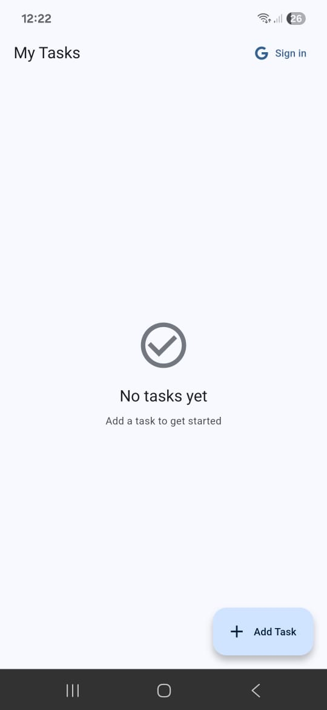
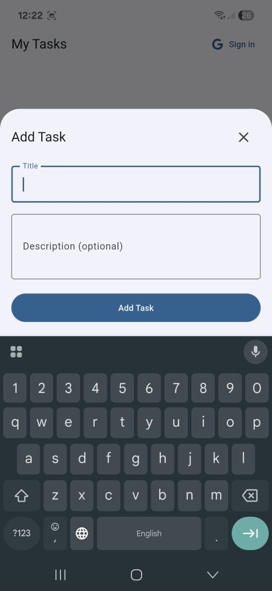

# TODO App with Google Sign-In

A simple Flutter todo application with Google authentication.

## Screenshots

<div align="center">
  
  
</div>

## Features

- Create, read, update, and delete todos
- Google Sign-In authentication
- Persistent data storage
- Clean and intuitive UI

## Getting Started

### Prerequisites

- Flutter SDK
- Android Studio / VS Code
- Google account for authentication

### Installation

1. Install dependencies:
```bash
flutter pub get
```

2. Configure Firebase:
   - Create a new Firebase project
   - Add your Android app to the Firebase project
   - Download and add `google-services.json` (Android)
   - Enable Google Sign-In in Firebase Authentication

3. Run the app:
```bash
flutter run
```

## Firebase Setup

1. Go to [Firebase Console](https://console.firebase.google.com/)
2. Create a new project
3. Add your Flutter app to the project
4. Enable Google Sign-In in Authentication section
5. Download configuration files and place them in the appropriate directories

## Usage

1. Launch the app
2. Sign in with your Google account (for save across devices)
3. Add your todos
4. Mark todos as complete
